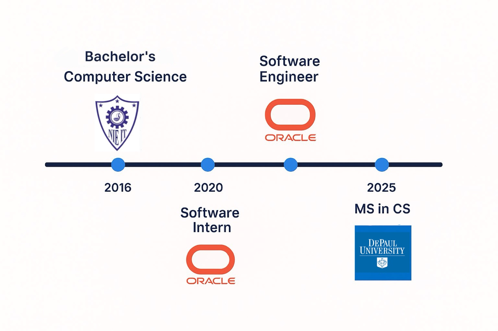
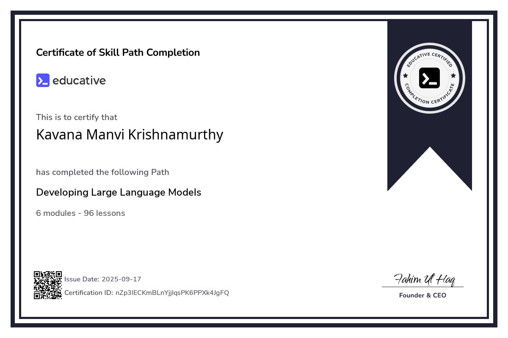
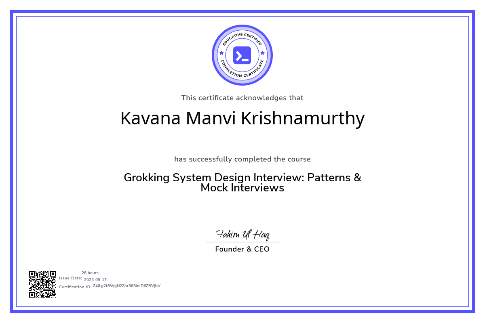

<html lang="en">
<head>
  <meta charset="utf-8" />
  <meta name="viewport" content="width=device-width, initial-scale=1" />
  <title>Kavana Manvi — Portfolio / Resume</title>

  
</head>
<body>

  <!-- Sticky tab nav -->
  

    <nav class="tabs-nav" role="navigation">
      <a href="#work-experience" class="tab-link" id="link-work">Work</a>
      <a href="#skills" class="tab-link" id="link-skills">Skills</a>
      <a href="#projects" class="tab-link" id="link-projects">Projects</a>
      <a href="#certificates" class="tab-link" id="link-certificates">Certificates</a>
    </nav>
  

  <main class="container" role="main">
    <!-- Hero image -->
    

    <h3 class="center" style="color: var(--accent);">I'd be a great fit for these roles</h3>

    <!-- Short link boxes -->
    

      <a class="link-box" href="https://github.com/kavanamk/Educative-DSA" target="_blank" rel="noopener noreferrer" role="listitem">DSA</a>
      <a class="link-box" href="https://github.com/kavanamk/Educative-System-Design" target="_blank" rel="noopener noreferrer" role="listitem">System Design</a>
      <a class="link-box" href="#projects" role="listitem">Projects</a>
      <a class="link-box" href="#work-experience" role="listitem">Work Experience</a>
    

    <!-- EDUCATION -->
    <section class="section" id="education">
      <h2>EDUCATION</h2>

      <h3>Master of Science, Computer Science</h3>
      
 DePaul University, Chicago (GPA - 3.86)

      <ul class="edu-list">
        <li><strong>Foundational CS courses:</strong> Object oriented programming, Distributed System, Database management system, Computer Programming, Algorithms and Data structures</li>
        <li><strong>Foundational Data Science courses:</strong> Fundamentals of Data Science in R, Data Visualization, Data Regression and analysis, Image Processing</li>
        <li><strong>Advanced Data Science courses:</strong> Programming Machine Learning Algorithms, Advanced Machine Learning, Computer Vision</li>
      </ul>

      <h3>Bachelor of Science, Computer Science</h3>
      
 NIE, India

      
Courses: Mathematics, Physics, Chemistry Statistics, Data Structure, Algorithms, Compiler Design, Cybersecurity, Internet of things, UI Design, Microprocessor and Assembly language, Java, J2EE, Database, Computer Architecture, OpenGL, Computer Graphics, Big Data, Data mining, Artificial Intelligence, Software Engineering, Unix

    </section>

    <!-- WORK EXPERIENCE -->
    <section class="section" id="work-experience" tabindex="-1">
      <h2>WORK EXPERIENCE</h2>

      <article style="margin-top:0.6rem;">
        <h3> Software Engineer at Oracle</h3>
        <ul class="edu-list">
          <li class="bullet">Performed Defect correction and management of ETL scripts and reports produced using SQL, OCI and Tableau.</li>
          <li class="bullet">Led full-stack development for 75+ Jira tickets, handling issue analysis, design, implementation, and testing.</li>
          <li class="bullet">Improved code runtime from 6–7 hours to 40 seconds, earning 2022 “Innovate and Simplify” Quarterly Award.</li>
          <li class="bullet">Recognised twice as “Star of the Sprint” for exceeding expectations with additional testing alongside sprint deliverables, removing roadblocks.</li>
          <li class="bullet">Conducted 35+ client issue investigations over 6 months to identify root causes.</li>
        </ul>
      </article>

      <article style="margin-top:1rem;">
        <h3> Software Intern at Oracle</h3>
        <ul class="edu-list">
          <li class="bullet">Developed full-stack web features for internal business performance application (eBoard) using ReactJS, Spring Boot, PHP, SQL, HTML, CSS, JavaScript, jQuery, and AJAX.</li>
          <li class="bullet">Delivered 6+ data visualization dashboards displaying Jenkins job execution status, improving visibility for 30+ revenue cycle teams.</li>
          <li class="bullet">Created summary and drill-down analytics reports used by directors and senior managers for performance oversight.</li>
        </ul>
      </article>
    </section>

    <!-- SKILLS -->
    <section class="section" id="skills" tabindex="-1">
      <h2>SKILLS</h2>
      
<strong>Programming Languages:</strong> C, C++, Java, T-SQL, PL/SQL, Python, Scala, Apache Spark, R, MySQL

      
<strong>Web Technology:</strong> HTML, CSS, JavaScript, PHP, jQuery, AJAX, ReactJS, JSON, XML

      
<strong>Machine Learning:</strong> TensorFlow, Octave, MATLAB, Tableau, PyTorch, deep learning

      
<strong>Others:</strong> Git, SVM, Excel, MS Office, SDLC – Agile and Jira, Jenkins, CI/CD

      
<strong>Soft skills:</strong> effective communication, problem-solving, critical thinking, growth mindset, curiosity

      

        <strong>I'm also an Expert in Data Structures, Algorithms and System design</strong>
      

      

        <a class="link-box" href="https://github.com/kavanamk/Educative-DSA" target="_blank" rel="noopener noreferrer">DSA</a>
        <a class="link-box" href="https://github.com/kavanamk/Educative-System-Design" target="_blank" rel="noopener noreferrer">System Design</a>
      

    </section>

    <!-- PROJECTS -->
    <section class="section" id="projects" tabindex="-1">
      <h2>PROJECTS</h2>

      

        

          <h3>Data Analysis and Visualization</h3>
          <a class="project-box" href="https://github.com/kavanamk/Distributed-Systems" target="_blank" rel="noopener noreferrer">
            
Predicting Birth Weight

            
Built a Regression model for dataset with 36 explanatory variables and 108,082 observations. Achieved 12% adjusted R-squared despite forward/backward selection, interaction terms, polynomials, and transformations — much variability remained unexplained.

            

              R
              Regression
              Data Analysis
              Hypothesis testing
            

          </a>
        

        <a class="project-box" href="https://github.com/kavanamk/Data-Visualization/blob/main/DV/Final%20Report%20Data%20Vizards.pdf" target="_blank" rel="noopener noreferrer">
          
Police Killing Dashboard

          
Visualizations including Sankey, Bar Graph, Star Plot and Interactive Choropleth for exploring police killings by age, race, armed status, gender, and income.

          

            R
            Tableau
            Data Visualization
          

        </a>

        <h3>Machine Learning</h3>

        <a class="project-box" href="https://github.com/kavanamk/Advanced-Machine-Learning/blob/main/AML/FinalProject/Kavana%20Autism%20Word%20doc.pdf" target="_blank" rel="noopener noreferrer">
          
Credit Risk

          
Engineered features and consolidated 30K+ loan purposes using TF-IDF + OpenAI API, enabling a 94% accurate credit risk model. Trained Logistic Regression, Random Forest, and XGBoost; evaluated with AUC, F1, and profit curves.

          

            Python
            scikit-learn
            OpenAI API
            NLP
            TF-IDF
          

        </a>

        <a class="project-box" href="https://github.com/kavanamk/Advanced-Machine-Learning/blob/main/AML/FinalProject/Kavana%20Autism%20Word%20doc.pdf" target="_blank" rel="noopener noreferrer">
          
Autism Screening

          
Used Mutual Information and Recursive Feature Elimination for feature selection. Evaluated XGBoost, SVM-RBF, Logistic Regression, Random Forest, and MLP. Achieved 97.2% CV accuracy and 1.0 sensitivity with SVM-RBF.

          

            Python
            scikit-learn
            XGBoost
            SVM
            MLP
          

        </a>

        <a class="project-box" href="https://github.com/kavanamk/Generative-AI" target="_blank" rel="noopener noreferrer">
          
Generative AI

          
Hands-on with RBMs, VAEs, GANs, and Transformers using TensorFlow 2. Built projects like image generation, deepfakes, music composition, and game agent training with GAIL.

          

            TensorFlow 2
            GAN
            VAE
            Transformers
            GAIL
          

        </a>

        <a class="project-box" href="https://github.com/kavanamk/Obesity-Level-Classification" target="_blank" rel="noopener noreferrer">
          
Obesity Level Classification

          
Collected, cleaned, and pre-processed data. Applied PCA and K-Means clustering. Achieved 92.95% accuracy using Decision Trees with pruning and tuned KNN.

          

            R
            PCA
            K-Means
            Decision Trees
            KNN
          

        </a>

        <a class="project-box" href="https://github.com/kavanamk/Natural-Language-Processing-using-Python" target="_blank" rel="noopener noreferrer">
          
Text Classification

          
Built a sentiment analysis pipeline using Bag of Words and TF-IDF with a Logistic Regression classifier. Trained on 2,000 samples and achieved 84.37% accuracy.

          

            Python
            NLP
            TF-IDF
            Logistic Regression
          

        </a>

        <a class="project-box" href="https://github.com/kavanamk/Programming-ML-Applications/blob/main/Final%20Project/Final_Project.ipynb" target="_blank" rel="noopener noreferrer">
          
Heart Failure Prediction

          
Implemented SVM, Decision Trees, and ensemble methods. Developed a weighted voting model using Random Forest, Bagging, and Boosting, reaching 88% accuracy.

          

            Python
            scikit-learn
            SVM
            Ensemble Learning
          

        </a>

        <h3>Software Development</h3>

        <a class="project-box" href="https://github.com/kavanamk/Distributed-Systems" target="_blank" rel="noopener noreferrer">
          
Distributed File Retrieval Engine

          
Built a distributed client-server file retrieval system with Java and ZeroMQ. Implemented multithreaded dispatcher/worker server with TF-based ranked search on Chameleon Cloud.

          

            Java
            ZeroMQ
            Multithreading
            Distributed System
          

        </a>

      

    </section>

    <!-- CERTIFICATES -->
    <section class="section" id="certificates" tabindex="-1">
      <h2>CERTIFICATES</h2>

      

        <h3>Machine Learning</h3>
        
The course includes supervised learning (linear regression, logistic regression, neural networks), unsupervised learning (clustering, dimensionality reduction), and key concepts like model evaluation, bias-variance tradeoff, and regularization. It emphasizes intuition behind algorithms and uses Octave/MATLAB for hands-on practice.

        

          
        

      

      

        <h3>Developing Large Language Models (LLMs)</h3>
        
Completed a Skill Path in PyTorch and Deep Learning, covering tensors, neural networks, autograd, and optimization. Gained hands-on experience with GANs, transformers, and attention mechanisms, leading up to training and fine-tuning LLMs for real-world NLP tasks.

        

          
        

      

      

        <h3>System Design</h3>
        
Abstractions, consistency models, distributed computing building blocks (CDN, DNS, Load Balancers, Key-value store, NoSQL, Cache, BLOBs, Monitoring systems, Search, Message Queues, Pub-sub, etc.). Extensive design of popular systems like YouTube, Instagram, Quora, Maps, TikTok, Uber.

        

          
        

      

    </section>

  </main>

  <!-- Small script to toggle .active on tab links and focus target section for accessibility -->
  

</body>
</html>
