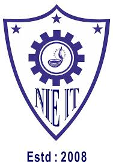
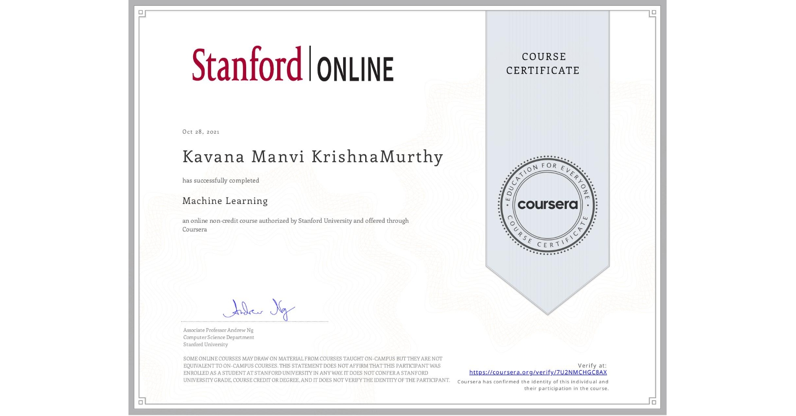

<h2 style="color: #2a7ae2;">EDUCATION</h2>

### Master of Science, Computer Science
###   Depaul University, Chicago (GPA - 3.8)

**Foundational CS courses-** Object oriented programming, Distributed System, Database management system, Computer Programming, Algorithms and Data structures

**Foundational Data Science courses-** Fundamentals of Data Science in R, Data Visualization, Data Regression and analysis, Image Processing 

**Advanced Data Science courses-** Programming Machine Learning Algorithms, Advanced Machine Learning, Computer Vision

### Bachelor of Science, Computer Science
###  NIE, India (GPA - 3.3)

**Courses :** Mathematics, Physics, Chemistry Statistics, Data Structure, Algorithms, Compiler Design, Cybersecurity, Internet of things, UI Desgin, Microprocessor and Assembly language, Java, J2EE, Database, Computer Architecture, OpenGL, Computer Graphics, Big Data, Data mining, Artificial Intelligence, Software Engineering, Unix

<h2 style="color: #2a7ae2;">WORK EXPERIENCE</h2>

###  Software Engineer at Oracle

•	Performed Defect correction and management of ETL sctipts and report produced using SQL, OCI and Tableau. 

•	Led full-stack development for 75+ Jira tickets, handling issue analysis, design, implementation, and testing.

•	Improved code runtime from 6–7 hours to 40 seconds, earning 2022 “Innovate and Simplify” Quarterly Award.

•	Recognised twice as “Star of the Sprint” for exceeding expectations with additional testing alongside sprint deliverables, removing roadblocks. 

•	Conducted 35+ client issue investigations over 6 months to identify root causes.

###   Software Intern at Oracle

•	Developed full-stack web features for internal business performance application (eBoard) using ReactJS, Spring Boot, PHP, SQL, HTML, CSS, JavaScript, jQuery, and AJAX.

•	Delivered 6+ data visualization dashboards displaying Jenkins job execution status, improving visibility for 30+ revenue cycle teams. Designed and implemented user-driven features and UI enhancements recognized by senior leadership for impact and design quality.

•	Created summary and drill-down analytics reports used by directors and senior managers for performance oversight.

## I'd be a great fit for these roles 

  
Data Analyst

  
Business Intelligence

  
Software Engineer

  
Data Scientist

<h2 style="color: #2a7ae2;">SKILLS</h2>

•	**Programming Language:** C, C++, Java, T-SQL,PL/SQL, Python, Scala, Apache Spark, R,Mysql etc

•	**Web Technology:** HTML, CSS, JavaScript, PHP, jQuery, AJAX, ReactJS , JSON, XML

•	**Machine Learning:** TensorFlow, Octave, MATLAB,  Tableau, Pytorch, deep learning, etc

•	**Others:** Git, SVM, Excel, MS Office, SDLC – Agile and Jira, Jenkins, CI/CD

•	**Soft skills:** effective communication, problem-solving skills, critical thinking, growth, curiosity, etc

<h2 style="color: #2a7ae2;">I'm also an Expert in Data Sructurers, Algorithm and System design</h2> 

  <a class="link-box" href="https://github.com/kavanamk/Educative-DSA" target="_blank">DSA</a>
  <a class="link-box" href="https://github.com/kavanamk/Educative-System-Design" target="_blank">System Design</a>

<h2 style="color: #2a7ae2;">PROJECTS</h2>

 <h3>Data Analysis and Vizualization </h3>
  <a class="project-box" href="https://github.com/kavanamk/Distributed-Systems" target="_blank">
    
Predicting Birth Weight

    
Built a Regression model for dataset with 36 explanatory variables and 108,082
observations. We achieved only a 12% adjusted R-squared. Despite applying advanced modeling techniques—including forward and backward selection, interaction terms, second-order polynomials, and variable transformations—most of the variability in birth weight remained unexplained.

    

      
R

      
Regression

      
Data Analysis

      
Hypothesis testing

    

  </a>

  <a class="project-box" href="https://github.com/kavanamk/Data-Visualization/blob/main/DV/Final%20Report%20Data%20Vizards.pdf" target="_blank">
    
Police Killing Dashboard

    
Our visualizations provide multiple perspectives on police killings.Sankey Plot shows the flow between age, race,
and unarmed incidents, and the Bar Graph focuses on killings of unarmed, non-attacking
individuals by race. The Star Plot compares geographic risk across regions and races, and the
Interactive Choropleth Map allows dynamic exploration by location, armed status, gender, race,
and income.

    

      
R

      
Tableau

      
Data Vizualization

    

  </a>
 <h3>Machine Learning</h3>
  <a class="project-box" href="https://github.com/kavanamk/Obesity-Level-Classification" target="_blank">
    
Obesity Level Classification

    
Collected, cleaned, and pre-processed data. Applied PCA and K-Means clustering. Achieved 92.95% accuracy using Decision Trees with pruning and KNN tuned for optimal k values.

    

      
R

      
PCA

      
K-Means

      
Decision Trees

      
KNN

    

  </a>

  <a class="project-box" href="https://github.com/kavanamk/Natural-Language-Processing-using-Python" target="_blank">
    
Text Classification

    
Built a sentiment analysis pipeline using Bag of Words and TF-IDF with a Logistic Regression classifier. Trained on 2,000 samples and achieved 84.37% accuracy.

    

      
Python

      
NLP

      
TF-IDF

      
Logistic Regression

    

  </a>

  <a class="project-box" href="https://github.com/kavanamk/Programming-ML-Applications/blob/main/Final%20Project/Final_Project.ipynb" target="_blank">
    
Heart Failure Prediction

    
Implemented SVM, Decision Trees, and ensemble methods. Developed a weighted voting model using Random Forest, Bagging, and Boosting, reaching 88% accuracy.

    

      
Python

      
scikit-learn

      
SVM

      
Ensemble Learning

      
Random Forest

      
Boosting

    

  </a>

  <a class="project-box" href="https://github.com/kavanamk/Advanced-Machine-Learning/blob/main/AML/FinalProject/Kavana%20Autism%20Word%20doc.pdf" target="_blank">
    
Autism Screening

    
Used Mutual Information and Recursive Feature Elimination for feature selection. Evaluated XGBoost, SVM-RBF, Logistic Regression, Random Forest, and MLP. Achieved 97.2% CV accuracy and 1.0 sensitivity with SVM-RBF.

    

      
Python

      
scikit-learn

      
XGBoost

      
SVM

      
MLP

    

  </a>

  <a class="project-box" href="https://github.com/kavanamk/Generative-AI" target="_blank">
    
Generative AI

    
Hands-on with RBMs, VAEs, GANs, and Transformers using TensorFlow 2. Built projects like image generation, deepfakes, music composition, and game agent training with GAIL.

    

      
TensorFlow 2

      
GAN

      
VAE

      
Transformers

      
GAIL

    

  </a>
  <h3>Software Development</h3>
  <a class="project-box" href="https://github.com/kavanamk/Distributed-Systems" target="_blank">
    
Distributed File Retrieval Engine

    
Built a distributed client-server file retrieval system with Java and ZeroMQ. Implemented multithreaded dispatcher/worker server with TF-based ranked search on Chameleon Cloud.

    

      
Java

      
ZeroMQ

      
Multithreading

      
Chameleon Cloud

      
Distributed System

    

  </a>

<h2 style="color: #2a7ae2;">CERTIFICATES</h2>

  

    <h2 style="margin-bottom: 0.5rem;">Machine Learning</h2>
    

      The course includes supervised learning (linear regression, logistic regression, neural networks), unsupervised learning (clustering, dimensionality reduction), and key concepts like model evaluation, bias-variance tradeoff, and regularization. It emphasizes intuition behind algorithms and uses Octave/MATLAB for hands-on practice.
    

    

      
    

  

