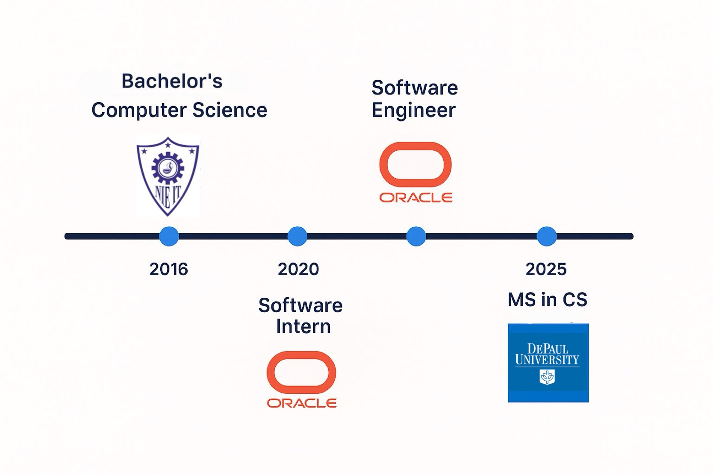

<!-- Navigation Bar -->

  <a href="#work-experience">Work</a>
  <a href="#skills">Skills</a>
  <a href="#projects">Projects</a>
  <a href="#certificates">Certificates</a>

<h3 style="text-align: center; color: #ff2d78;">
  I'd be a great fit for these roles
</h3>

<!-- Data Roles Section -->

  

    
Data Analyst

    
Transform data into insights

    

      SQL (3+ years)
      R
      Python (NumPy, Pandas)
      Excel
      Tableau
    

  

  

    
Data Engineer

    
Build data pipelines & Data Lakehouses

    

      ETL Pipelines
      SQL (3+ years)
      Spark / Pyspark
      AWS S3
      GCP
      Snowflake
    

  

  

    
AI / ML Data Scientist

    
Develop predictive & AI models

    

      SQL
      R
      Python (scikit-learn, TensorFlow/Keras, PyTorch)
      Predictive Modeling
      Statistical Analysis
      Generative AI
      LLMs
      Multi-Agents
      RAG
      Vector Databases
    

  

<!-- Link Boxes Style -->

<!-- EDUCATION -->
<h2 id="education" style="color: #ff2d78; padding-top: 3rem;">EDUCATION</h2>

  <h3>Master of Science, Computer Science</h3>
  <h4>DePaul University, Chicago &nbsp;·&nbsp; GPA: 3.86</h4>
  
<strong>Foundational CS:</strong> Object Oriented Programming, Distributed Systems, Database Management, Algorithms & Data Structures

  
<strong>Foundational Data Science:</strong> Fundamentals of Data Science in R, Data Visualization, Data Regression & Analysis, Image Processing

  
<strong>Advanced Data Science:</strong> Programming ML Algorithms, Advanced Machine Learning, Computer Vision

  <h3>Bachelor of Science, Computer Science</h3>
  <h4>NIE, India</h4>
  
<strong>Courses:</strong> Mathematics, Statistics, Data Structures, Algorithms, Compiler Design, Cybersecurity, IoT, Microprocessor & Assembly, Java, J2EE, Database, Computer Architecture, OpenGL, Big Data, Data Mining, AI, Software Engineering, Unix

<!-- WORK EXPERIENCE -->
<h2 id="work-experience" style="color: #ff2d78;">WORK EXPERIENCE</h2>

  <h3>Software Engineer — Oracle</h3>
  <ul>
    <li>Performed defect correction and management of ETL scripts and reports using SQL, OCI and Tableau.</li>
    <li>Led full-stack development for <strong>75+ Jira tickets</strong>, handling issue analysis, design, implementation, and testing.</li>
    <li><strong>Improved code runtime from 6–7 hours to 40 seconds</strong>, earning 2022 "Innovate and Simplify" Quarterly Award.</li>
    <li>Recognised twice as <strong>"Star of the Sprint"</strong> for exceeding expectations with additional testing alongside sprint deliverables, removing roadblocks.</li>
    <li>Conducted <strong>35+ client issue investigations</strong> over 6 months to identify root causes.</li>
  </ul>

  <h3>Software Intern — Oracle</h3>
  <ul>
    <li>Developed full-stack web features for internal business performance application (eBoard) using ReactJS, Spring Boot, PHP, SQL, HTML, CSS, JavaScript, jQuery, and AJAX.</li>
    <li>Delivered <strong>6+ data visualization dashboards</strong> displaying Jenkins job execution status, improving visibility for 30+ revenue cycle teams. Recognized by senior leadership for impact and design quality.</li>
    <li>Created summary and drill-down analytics reports used by directors and senior managers for performance oversight.</li>
  </ul>

<!-- SKILLS -->
<h2 id="skills" style="color: #ff2d78;">SKILLS</h2>

  <ul>
    <li><strong>Programming Language:</strong> Python, R, C, Java, Scala, C++</li>
    <li><strong>Big Data:</strong> HDFS, Spark, Hadoop, GCP — Cloud Storage, BigQuery, Pub/Sub, Dataflow</li>
    <li><strong>Machine Learning:</strong> TensorFlow, PyTorch, Keras, Octave, MATLAB, Generative AI, NLP, CV</li>
    <li><strong>Web Technology:</strong> HTML, CSS, JavaScript, PHP, jQuery, AJAX, ReactJS, JSON, XML</li>
    <li><strong>Others:</strong> Git, SVM, Subversion, Excel, MS Office, SDLC – Agile & Jira, Jenkins, CI/CD</li>
    <li><strong>Soft Skills:</strong> Effective communication, problem-solving, critical thinking, growth mindset, curiosity</li>
  </ul>

<h2 style="color: #ff2d78;">I'm also an Expert in Data Structures, Algorithms and System Design</h2>

  <a class="link-box" href="https://github.com/kavanamk/Educative-DSA" target="_blank">DSA</a>
  <a class="link-box" href="https://github.com/kavanamk/Educative-System-Design" target="_blank">System Design</a>

<!-- ML BLOG -->
<h2 id="ml-blog" style="color: #ff2d78; padding-top: 3rem;">MACHINE LEARNING BLOG</h2>

  

    
  

  

    As a Machine Learning practitioner, I translate complex data into actionable, intelligent solutions. My expertise spans the entire ML lifecycle — from rigorous data preparation and statistical modeling to implementing cutting-edge Deep Learning and Generative AI architectures. I focus on building and deploying scalable models, including Supervised, Unsupervised, and Reinforcement Learning systems.
  

  <a href="https://kavanamlstuff.blogspot.com/" target="_blank" class="skill-tag" style="margin-top: 0.5rem; display: inline-block;">Read Full Blog →</a>

<!-- PROJECTS -->
<h2 id="projects" style="color: #ff2d78;">PROJECTS</h2>

  <h3>Data Analysis & Visualization</h3>

  <a class="project-box" href="https://github.com/kavanamk/Distributed-Systems" target="_blank">
    
Predicting Birth Weight

    
Built a Regression model for dataset with 36 explanatory variables and 108,082 observations. Applied forward and backward selection, interaction terms, second-order polynomials, and variable transformations.

    

      
R

      
Regression

      
Data Analysis

      
Hypothesis Testing

    

  </a>

  <a class="project-box" href="https://github.com/kavanamk/Data-Visualization/blob/main/DV/Final%20Report%20Data%20Vizards.pdf" target="_blank">
    
Police Killing Dashboard

    
Multi-perspective visualizations on police killings. Sankey Plot for age/race/unarmed incidents, Bar Graph for unarmed killings by race, Star Plot for geographic risk, and Interactive Choropleth Map for dynamic exploration.

    

      
R

      
Tableau

      
Data Visualization

    

  </a>

  <h3>Machine Learning</h3>

  <a class="project-box" href="https://github.com/kavanamk/Advanced-Machine-Learning/blob/main/AML/FinalProject/Kavana%20Autism%20Word%20doc.pdf" target="_blank">
    
Credit Risk

    
Engineered features and consolidated 30K+ loan purposes using TF-IDF + OpenAI API, enabling 94% accurate credit risk prediction. Trained and optimized Logistic Regression, Random Forest, and XGBoost using GridSearchCV.

    

      
Python

      
scikit-learn

      
OpenAI API

      
NLP

      
TF-IDF

    

  </a>

  <a class="project-box" href="https://github.com/kavanamk/Advanced-Machine-Learning/blob/main/AML/FinalProject/Kavana%20Autism%20Word%20doc.pdf" target="_blank">
    
Autism Screening

    
Used Mutual Information and Recursive Feature Elimination for feature selection. Evaluated XGBoost, SVM-RBF, Logistic Regression, Random Forest, and MLP. Achieved 97.2% CV accuracy and 1.0 sensitivity with SVM-RBF.

    

      
Python

      
scikit-learn

      
XGBoost

      
SVM

      
MLP

    

  </a>

  <a class="project-box" href="https://github.com/kavanamk/Generative-AI" target="_blank">
    
Generative AI

    
Hands-on with RBMs, VAEs, GANs, and Transformers using TensorFlow 2. Built projects including image generation, deepfakes, music composition, and game agent training with GAIL.

    

      
TensorFlow 2

      
GAN

      
VAE

      
Transformers

      
GAIL

    

  </a>

  <a class="project-box" href="https://github.com/kavanamk/Obesity-Level-Classification" target="_blank">
    
Obesity Level Classification

    
Collected, cleaned, and pre-processed data. Applied PCA and K-Means clustering. Achieved 92.95% accuracy using Decision Trees with pruning and KNN tuned for optimal k values.

    

      
R

      
PCA

      
K-Means

      
Decision Trees

      
KNN

    

  </a>

  <a class="project-box" href="https://github.com/kavanamk/Natural-Language-Processing-using-Python" target="_blank">
    
Text Classification

    
Built a sentiment analysis pipeline using Bag of Words and TF-IDF with a Logistic Regression classifier. Trained on 2,000 samples and achieved 84.37% accuracy.

    

      
Python

      
NLP

      
TF-IDF

      
Logistic Regression

    

  </a>

  <a class="project-box" href="https://github.com/kavanamk/Programming-ML-Applications/blob/main/Final%20Project/Final_Project.ipynb" target="_blank">
    
Heart Failure Prediction

    
Implemented SVM, Decision Trees, and ensemble methods. Developed a weighted voting model using Random Forest, Bagging, and Boosting, reaching 88% accuracy.

    

      
Python

      
scikit-learn

      
SVM

      
Ensemble Learning

      
Random Forest

      
Boosting

    

  </a>

  <h3>Software Development</h3>

  <a class="project-box" href="https://github.com/kavanamk/Distributed-Systems" target="_blank">
    
Distributed File Retrieval Engine

    
Built a distributed client-server file retrieval system with Java and ZeroMQ. Implemented multithreaded dispatcher/worker server with TF-based ranked search on Chameleon Cloud.

    

      
Java

      
ZeroMQ

      
Multithreading

      
Chameleon Cloud

      
Distributed System

    

  </a>

<!-- CERTIFICATES -->
<h2 id="certificates" style="color: #ff2d78;">CERTIFICATES</h2>

  <h2>Machine Learning</h2>
  
The course includes supervised learning (linear regression, logistic regression, neural networks), unsupervised learning (clustering, dimensionality reduction), and key concepts like model evaluation, bias-variance tradeoff, and regularization. Emphasizes intuition behind algorithms and uses Octave/MATLAB for hands-on practice.

  

    
  

  <h2>Developing Large Language Models (LLMs)</h2>
  
Completed a Skill Path in PyTorch and Deep Learning, covering tensors, neural networks, autograd, and optimization. Gained hands-on experience with GANs, transformers, and attention mechanisms, leading up to training and fine-tuning LLMs (e.g., BERT) for real-world NLP tasks.

  

    
  

  <h2>System Design</h2>
  
Abstractions, consistency models, distributed computing. Building block architecture — CDN, DNS, Load Balancers, Key-Value Store, Databases, NoSQL, Cache, BLOB, Monitoring, Distributed Search, Message Queues, Logging, Sequencer, Pub/Sub, Shared Counter. Extensive system design of 10+ concepts: YouTube, Instagram, Quora, Google Maps, TikTok, Uber, Uber Eats etc.

  

    
  

<!-- FOOTER -->

  Built by Kavana Manvi Krishnamurthy · Hosted on GitHub Pages

