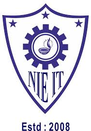
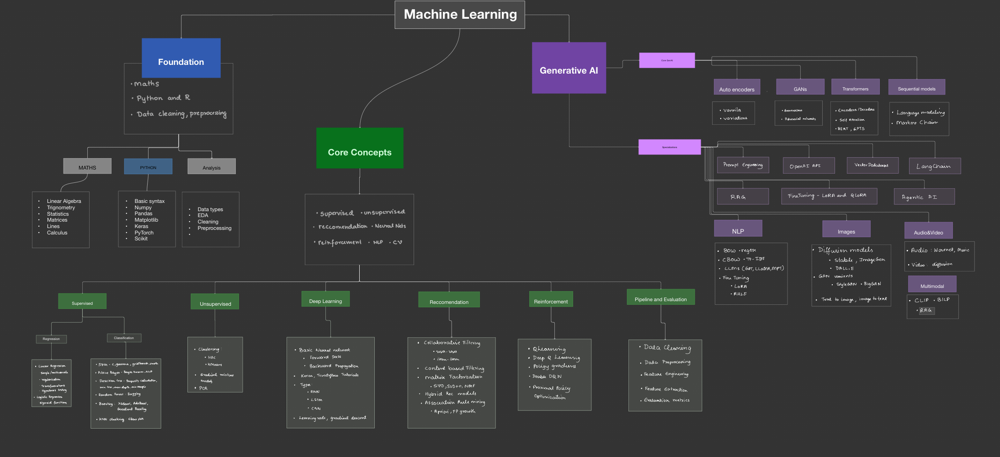
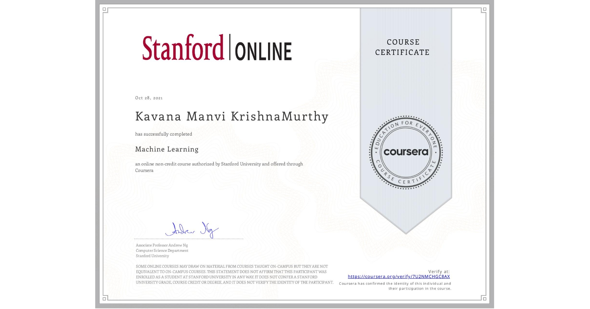
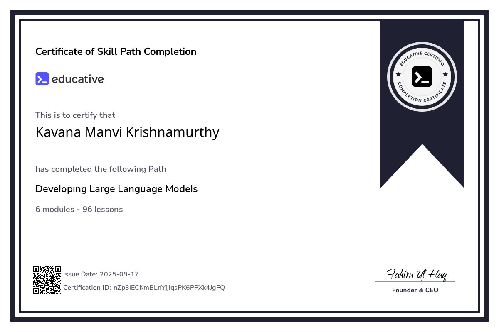
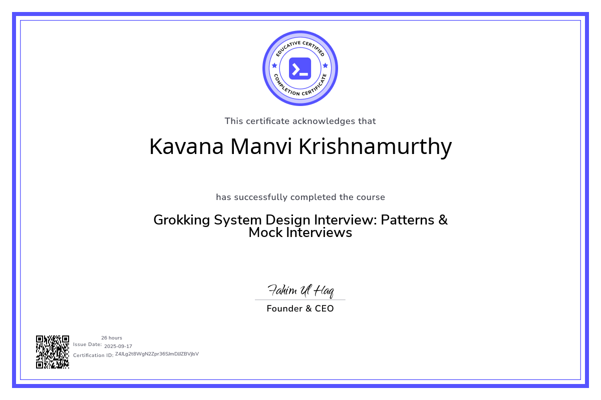

<html lang="en">
<head>
  <meta charset="UTF-8" />
  <meta name="viewport" content="width=device-width, initial-scale=1.0" />
  <title>Kavana Manvi Krishnamurthy</title>
  <link href="https://fonts.googleapis.com/css2?family=Poppins:wght@400;500;600;700&display=swap" rel="stylesheet" />
  
</head>
<body>

  <!-- ── HERO ── -->
  

    <h1>Kavana Manvi Krishnamurthy</h1>
    

      
      

        

          The secret ingredient behind my great coding skills is love — and a lot of discipline!
          I bring a solid foundation in software engineering from my time at Oracle and a Master's in Computer Science.
          I'm passionate about Machine Learning, Data Analytics, and solving tough problems (300+ on LeetCode!).
        

        

          <a class="social-btn" href="https://linkedin.com/in/kavanamk" target="_blank">
            <svg width="14" height="14" viewBox="0 0 24 24" fill="#ff2d78"><path d="M16 8a6 6 0 016 6v7h-4v-7a2 2 0 00-2-2 2 2 0 00-2 2v7h-4v-7a6 6 0 016-6zM2 9h4v12H2z"/><circle cx="4" cy="4" r="2"/></svg>
            LinkedIn
          </a>
          <a class="social-btn" href="https://github.com/kavanamk" target="_blank">
            <svg width="14" height="14" viewBox="0 0 24 24" fill="#ff2d78"><path d="M12 2C6.477 2 2 6.477 2 12c0 4.418 2.865 8.166 6.839 9.489.5.092.682-.217.682-.482 0-.237-.009-.868-.013-1.703-2.782.604-3.369-1.342-3.369-1.342-.454-1.154-1.11-1.462-1.11-1.462-.908-.62.069-.608.069-.608 1.003.07 1.531 1.03 1.531 1.03.892 1.529 2.341 1.087 2.91.832.092-.647.35-1.088.636-1.338-2.22-.253-4.555-1.11-4.555-4.943 0-1.091.39-1.984 1.029-2.683-.103-.253-.446-1.27.098-2.647 0 0 .84-.269 2.75 1.025A9.578 9.578 0 0112 6.836a9.59 9.59 0 012.504.337c1.909-1.294 2.747-1.025 2.747-1.025.546 1.377.202 2.394.1 2.647.64.699 1.028 1.592 1.028 2.683 0 3.842-2.339 4.687-4.566 4.935.359.309.678.919.678 1.852 0 1.336-.012 2.415-.012 2.743 0 .267.18.578.688.48C19.138 20.163 22 16.418 22 12c0-5.523-4.477-10-10-10z"/></svg>
            GitHub
          </a>
          <a class="social-btn" href="https://kavanamlstuff.blogspot.com/" target="_blank">
            <svg width="14" height="14" viewBox="0 0 24 24" fill="#ff2d78"><path d="M19 3H5a2 2 0 00-2 2v14a2 2 0 002 2h14a2 2 0 002-2V5a2 2 0 00-2-2zm-5 14H7v-2h7v2zm3-4H7v-2h10v2zm0-4H7V7h10v2z"/></svg>
            ML Blog
          </a>
          <a class="social-btn" href="https://x.com/kavmlstuff" target="_blank">
            <svg width="14" height="14" viewBox="0 0 24 24" fill="#ff2d78"><path d="M18.244 2.25h3.308l-7.227 8.26 8.502 11.24H16.17l-5.214-6.817L4.99 21.75H1.68l7.73-8.835L1.254 2.25H8.08l4.713 6.231zm-1.161 17.52h1.833L7.084 4.126H5.117z"/></svg>
            X / Twitter
          </a>
        

      

    

  

  <!-- ── NAVBAR ── -->
  <nav class="navbar">
    <a href="#work-experience">Work</a>
    <a href="#skills">Skills</a>
    <a href="#projects">Projects</a>
    <a href="#certificates">Certificates</a>
  </nav>

  <!-- ── ROLES ── -->
  

    <h3 style="text-align:center; color:#ff2d78; margin: 2rem 0 0.5rem;">I'd be a great fit for these roles</h3>
    

      

        
Data Analyst

        
Transform data into insights

        

          SQL (3+ years)
          R
          Python (NumPy, Pandas)
          Excel
          Tableau
        

      

      

        
Data Engineer

        
Build data pipelines & Data Lakehouses

        

          ETL Pipelines
          SQL (3+ years)
          Spark / PySpark
          AWS S3
          GCP
          Snowflake
        

      

      

        
AI / ML Data Scientist

        
Develop predictive & AI models

        

          SQL
          R
          Python (scikit-learn, TensorFlow/Keras, PyTorch)
          Predictive Modeling
          Statistical Analysis
          Generative AI
          LLMs
          Multi-Agents
          RAG
          Vector Databases
        

      

    

    <!-- ── EDUCATION ── -->
    <h2 id="education" class="section-heading">EDUCATION</h2>

    

      <h3>Master of Science, Computer Science</h3>
      <h4>DePaul University, Chicago &nbsp;·&nbsp; GPA: 3.86</h4>
      
<strong>Foundational CS:</strong> Object Oriented Programming, Distributed Systems, Database Management, Algorithms & Data Structures

      
<strong>Foundational Data Science:</strong> Fundamentals of Data Science in R, Data Visualization, Data Regression & Analysis, Image Processing

      
<strong>Advanced Data Science:</strong> Programming ML Algorithms, Advanced Machine Learning, Computer Vision

    

    

      <h3>Bachelor of Science, Computer Science</h3>
      <h4>NIE, India</h4>
      
<strong>Courses:</strong> Mathematics, Statistics, Data Structures, Algorithms, Compiler Design, Cybersecurity, IoT, Microprocessor & Assembly, Java, J2EE, Database, Computer Architecture, OpenGL, Big Data, Data Mining, AI, Software Engineering, Unix

    

    <!-- ── WORK EXPERIENCE ── -->
    <h2 id="work-experience" class="section-heading">WORK EXPERIENCE</h2>

    

      <h3>Software Engineer — Oracle</h3>
      <ul>
        <li>Performed defect correction and management of ETL scripts and reports using SQL, OCI and Tableau.</li>
        <li>Led full-stack development for <strong>75+ Jira tickets</strong>, handling issue analysis, design, implementation, and testing.</li>
        <li><strong>Improved code runtime from 6–7 hours to 40 seconds</strong>, earning 2022 "Innovate and Simplify" Quarterly Award.</li>
        <li>Recognised twice as <strong>"Star of the Sprint"</strong> for exceeding expectations with additional testing alongside sprint deliverables, removing roadblocks.</li>
        <li>Conducted <strong>35+ client issue investigations</strong> over 6 months to identify root causes.</li>
      </ul>
    

    

      <h3>Software Intern — Oracle</h3>
      <ul>
        <li>Developed full-stack web features for internal business performance application (eBoard) using ReactJS, Spring Boot, PHP, SQL, HTML, CSS, JavaScript, jQuery, and AJAX.</li>
        <li>Delivered <strong>6+ data visualization dashboards</strong> displaying Jenkins job execution status, improving visibility for 30+ revenue cycle teams. Recognized by senior leadership for impact and design quality.</li>
        <li>Created summary and drill-down analytics reports used by directors and senior managers for performance oversight.</li>
      </ul>
    

    <!-- ── SKILLS ── -->
    <h2 id="skills" class="section-heading">SKILLS</h2>

    

      <ul>
        <li><strong>Programming Language:</strong> Python, R, C, Java, Scala, C++</li>
        <li><strong>Big Data:</strong> HDFS, Spark, Hadoop, GCP — Cloud Storage, BigQuery, Pub/Sub, Dataflow</li>
        <li><strong>Machine Learning:</strong> TensorFlow, PyTorch, Keras, Octave, MATLAB, Generative AI, NLP, CV</li>
        <li><strong>Web Technology:</strong> HTML, CSS, JavaScript, PHP, jQuery, AJAX, ReactJS, JSON, XML</li>
        <li><strong>Others:</strong> Git, SVM, Subversion, Excel, MS Office, SDLC – Agile & Jira, Jenkins, CI/CD</li>
        <li><strong>Soft Skills:</strong> Effective communication, problem-solving, critical thinking, growth mindset, curiosity</li>
      </ul>
    

    <h2 style="color:#ff2d78; font-size:1.1rem; margin-bottom:0.5rem;">I'm also an Expert in Data Structures, Algorithms and System Design</h2>
    

      <a class="link-box" href="https://github.com/kavanamk/Educative-DSA" target="_blank">DSA</a>
      <a class="link-box" href="https://github.com/kavanamk/Educative-System-Design" target="_blank">System Design</a>
    

    <!-- ── ML BLOG ── -->
    <h2 id="ml-blog" class="section-heading">MACHINE LEARNING BLOG</h2>

    

      

        
      

      

        As a Machine Learning practitioner, I translate complex data into actionable, intelligent solutions. My expertise spans the entire ML lifecycle — from rigorous data preparation and statistical modeling to implementing cutting-edge Deep Learning and Generative AI architectures. I focus on building and deploying scalable models, including Supervised, Unsupervised, and Reinforcement Learning systems, consistently driving innovation by turning theoretical concepts into robust, real-world predictive and creative applications.
      

      <a href="https://kavanamlstuff.blogspot.com/" target="_blank" class="skill-tag">Read Full Blog →</a>
    

    <!-- ── PROJECTS ── -->
    <h2 id="projects" class="section-heading">PROJECTS</h2>

    

      <h3>Data Analysis & Visualization</h3>

      <a class="project-box" href="https://github.com/kavanamk/Distributed-Systems" target="_blank">
        
Predicting Birth Weight

        
Built a Regression model for dataset with 36 explanatory variables and 108,082 observations. Applied forward and backward selection, interaction terms, second-order polynomials, and variable transformations.

        

          RRegressionData AnalysisHypothesis Testing
        

      </a>

      <a class="project-box" href="https://github.com/kavanamk/Data-Visualization/blob/main/DV/Final%20Report%20Data%20Vizards.pdf" target="_blank">
        
Police Killing Dashboard

        
Multi-perspective visualizations on police killings. Sankey Plot for age/race/unarmed incidents, Bar Graph for unarmed killings by race, Star Plot for geographic risk, and Interactive Choropleth Map for dynamic exploration.

        

          RTableauData Visualization
        

      </a>

      <h3>Machine Learning</h3>

      <a class="project-box" href="https://github.com/kavanamk/Advanced-Machine-Learning/blob/main/AML/FinalProject/Kavana%20Autism%20Word%20doc.pdf" target="_blank">
        
Credit Risk

        
Engineered features and consolidated 30K+ loan purposes using TF-IDF + OpenAI API, enabling 94% accurate credit risk prediction. Trained and optimized Logistic Regression, Random Forest, and XGBoost using GridSearchCV.

        

          Pythonscikit-learnOpenAI APINLPTF-IDF
        

      </a>

      <a class="project-box" href="https://github.com/kavanamk/Advanced-Machine-Learning/blob/main/AML/FinalProject/Kavana%20Autism%20Word%20doc.pdf" target="_blank">
        
Autism Screening

        
Used Mutual Information and Recursive Feature Elimination for feature selection. Evaluated XGBoost, SVM-RBF, Logistic Regression, Random Forest, and MLP. Achieved 97.2% CV accuracy and 1.0 sensitivity with SVM-RBF.

        

          Pythonscikit-learnXGBoostSVMMLP
        

      </a>

      <a class="project-box" href="https://github.com/kavanamk/Generative-AI" target="_blank">
        
Generative AI

        
Hands-on with RBMs, VAEs, GANs, and Transformers using TensorFlow 2. Built projects including image generation, deepfakes, music composition, and game agent training with GAIL.

        

          TensorFlow 2GANVAETransformersGAIL
        

      </a>

      <a class="project-box" href="https://github.com/kavanamk/Obesity-Level-Classification" target="_blank">
        
Obesity Level Classification

        
Collected, cleaned, and pre-processed data. Applied PCA and K-Means clustering. Achieved 92.95% accuracy using Decision Trees with pruning and KNN tuned for optimal k values.

        

          RPCAK-MeansDecision TreesKNN
        

      </a>

      <a class="project-box" href="https://github.com/kavanamk/Natural-Language-Processing-using-Python" target="_blank">
        
Text Classification

        
Built a sentiment analysis pipeline using Bag of Words and TF-IDF with a Logistic Regression classifier. Trained on 2,000 samples and achieved 84.37% accuracy.

        

          PythonNLPTF-IDFLogistic Regression
        

      </a>

      <a class="project-box" href="https://github.com/kavanamk/Programming-ML-Applications/blob/main/Final%20Project/Final_Project.ipynb" target="_blank">
        
Heart Failure Prediction

        
Implemented SVM, Decision Trees, and ensemble methods. Developed a weighted voting model using Random Forest, Bagging, and Boosting, reaching 88% accuracy.

        

          Pythonscikit-learnSVMEnsemble LearningRandom ForestBoosting
        

      </a>

      <h3>Software Development</h3>

      <a class="project-box" href="https://github.com/kavanamk/Distributed-Systems" target="_blank">
        
Distributed File Retrieval Engine

        
Built a distributed client-server file retrieval system with Java and ZeroMQ. Implemented multithreaded dispatcher/worker server with TF-based ranked search on Chameleon Cloud.

        

          JavaZeroMQMultithreadingChameleon CloudDistributed System
        

      </a>

    

    <!-- ── CERTIFICATES ── -->
    <h2 id="certificates" class="section-heading">CERTIFICATES</h2>

  
<!-- end section-wrap -->

  

    <h2>Machine Learning</h2>
    
The course includes supervised learning (linear regression, logistic regression, neural networks), unsupervised learning (clustering, dimensionality reduction), and key concepts like model evaluation, bias-variance tradeoff, and regularization. Emphasizes intuition behind algorithms and uses Octave/MATLAB for hands-on practice.

    

      
    

  

  

    <h2>Developing Large Language Models (LLMs)</h2>
    
Completed a Skill Path in PyTorch and Deep Learning, covering tensors, neural networks, autograd, and optimization. Gained hands-on experience with GANs, transformers, and attention mechanisms, leading up to training and fine-tuning LLMs (e.g., BERT) for real-world NLP tasks.

    

      
    

  

  

    <h2>System Design</h2>
    
Abstractions, consistency models, distributed computing. Building block architecture — CDN, DNS, Load Balancers, Key-Value Store, Databases, NoSQL, Cache, BLOB, Monitoring, Distributed Search, Message Queues, Logging, Sequencer, Pub/Sub, Shared Counter. Extensive system design of 10+ concepts: YouTube, Instagram, Quora, Google Maps, TikTok, Uber, Uber Eats etc.

    

      
    

  

  

    Built by Kavana Manvi Krishnamurthy · Hosted on GitHub Pages
  

</body>
</html>
